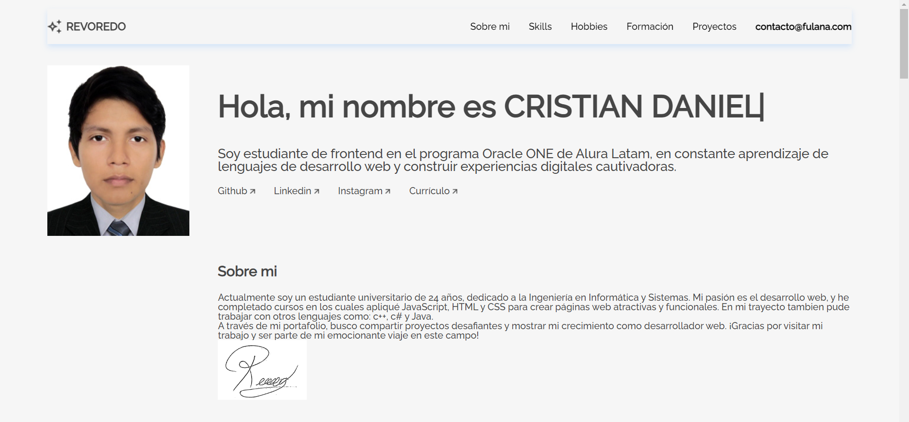

###🔹Para ejecutar: npm start
# Challenge ONE | Front End -  Portafolio

     

### ¡Bienvenido al proyecto base del Portafolio ! Pasos principales:
---

### Analisando el repositorio!
---
### Este es el repositorio base de nuestro proyecto, acá tendrás:
#### 🔹index.html: Documento HTML concluído que puedes utilizar en tu proyecto. Las fuentes, los archivos CSS y Javascript ya están referenciados en el documento y todas las secciones contienen comentários que te ayudan a entender la estructura. Si quieres, puedes aventurarte y contruir tu propio HTML.
#### 🔹style.css: Documento de CSS con instrucciones de estilo.
#### 🔹validacion.js: Documento vacío dónde vas a desarrollar tu lógica de programación para validar formularios usando Javascript.

🔹 [Link del DEMO](https://crisdaniel.github.io/ChallengeONE_PORTAFOLIO/)

